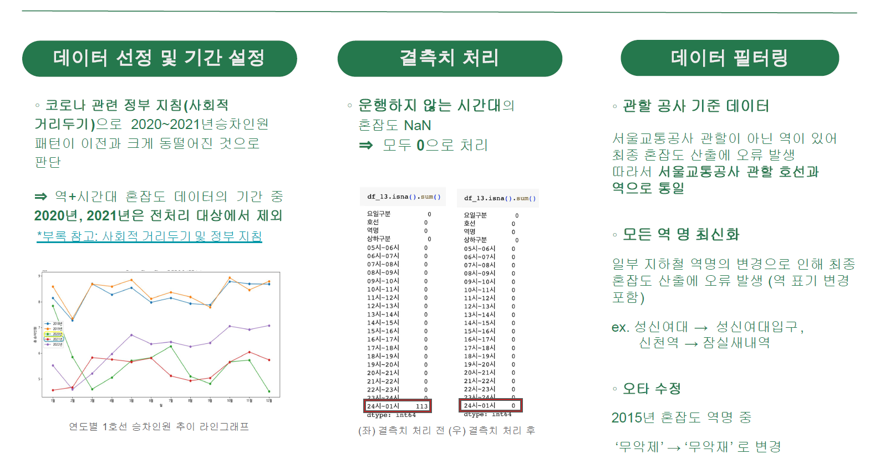
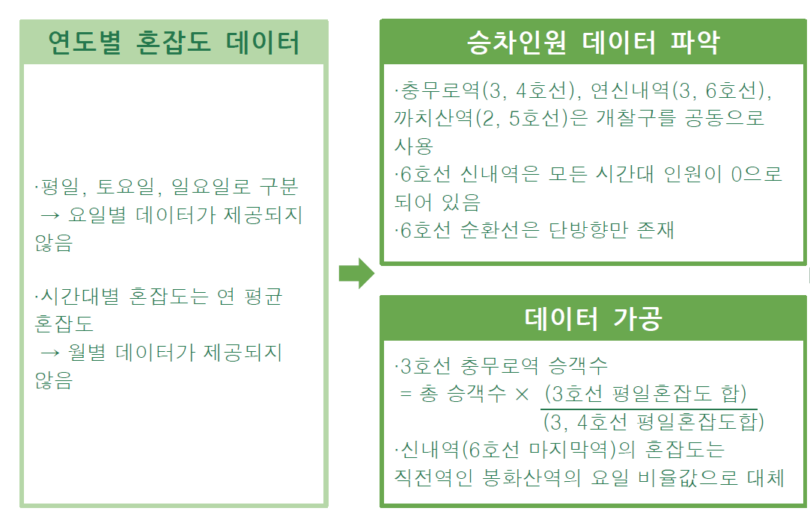
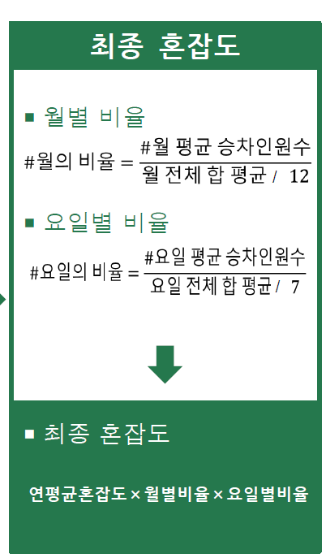

# 멀티캠퍼스 세미프로젝트 (23.09.01 ~ 23.09.26) 
| 교육기간(23.06.26 ~ 23.12.06) 중 처음하는 프로젝트이다.

## 서비스 결과
  - 유튜브 링크 : https://www.youtube.com/watch?v=phZRdA8Wsik
  - 서비스 링크 : http://15.152.248.112:8000/

      - 서비스 링크의 경우, 잡아먹는 리소스가 너무 커 서버를 계속 켜둘 수 없음. 사용모습은 유튜브로 확인 또는 웹 개발 팀원에 연락 필요
    
        - 웹개발 팀원 : https://kimec995.github.io/

    
    
    
    

## 주제 : 지하철 혼잡도 예측 및 사용자 분산 서비스
  - 주제선정 배경 : 이태원 참사 이후 군중밀집의 위험성에 대한 인식 상승, 지하철 혼잡에 대한 경각심도 함께 대두 됨. 우리 프로젝트가 혼잡도 문제를 해결하는데 조금은 도움이 되지 않을까 하여 기획 

## 혼잡도란?
  - 국토교통부 예규에서 좌석 54개에 사람이 모두 앉아 있는 것을 34%, 1량 정원 160명을 100%로 기준 삼아 나타내는 수치.
  - 영국 서퍽대학교 군중과학 객원 교수인 Keith Still 교수의 연구에 따르면 1m^2의 공간에 5명부터 군중 밀집 임계점이라고 함.
  - 54명(좌석) + {32.56m^2(열차입석면적평균)x5(임계점)} = 216.8명 => 혼잡도 135.5%
  - 위 처럼 계산해보면 혼잡도가 135.5 이상일 경우 사고가 날 가능성이 높다고 볼 수 있다.

## 데이터 수집
  - 서울열린데이터광장, 공공데이터포털, 기상청에서 데이터 수집

## 변수 선정
  - 1. 월
    2. 요일
    3. 시간대
    4. 기상조건
    5. 추가적인 파생변수 고려
   
## EDA
  - 1. 월 / 월별 승객 수 비교
       

       - 봄,가을에는 증가하는 추세
       - 여름, 겨울에는 감소하는 추세
       - 주기성을 보임 (역마다 주기성이 조금씩 다름)
       - 유의미한 변수로 판단

    2. 요일 / 요일별 승객 수 비교
       

       - 월요일부터 금요일까지 승객 수 증가
       - 토,일요일에는 승객 수가 급격히 감소
       - 위 그래프는 성신여대입구역을 기준으로 나타낸것, 다른 역들은 또 다른 다양한 변화를 보임
       - 유의미한 변수로 판단

      
    3. 시간대 / 시간대별 승객 수 비교 (상하선 구분)
       .png)
   
       .png)

       .png)

       - 출/퇴근 시간대에 특히나 많은 이용객이 있는 것을 알 수 있음
       - 반면에 새벽시간대는 거의 없다.
       - 유의미한 변수로 판단
      

    5. 기상조건
       
       

       

       

       - 처음 가설로 설정했던 비가 많이 올 수록, 강수량이 높을 수록 지하철 이용객이 많을 것으로 예상한것과 달리 큰 관련성이 없게 나왔고 기온도 마찬가지로 큰 영향을 주지 못했다.
       - 기상조건 또 한 가설과 다르고 오차범위가 너무 크게 나타났다.
       - 적절한 변수가 되지 못한다.

## 데이터 필터링 및 가공

- raw data에는 평일, 토요일, 일요일로 구분되어 있어 월화수목금의 요일 구분이 없다. 또한 연 평균 데이터다 보니 월별 데이터는 따로 제공되지 않았다.
    - 이를 해결하기 위해 일자별로 데이터가 있는 승하차 인원 데이터를 이용했다.
-  승하차 인원 데이터에 충무록역, 연신내역, 까치산역은 환승역임에도 개찰구를 공동으로 사용해 한쪽 호선에 승하차인원이 합쳐져 통계되고 다른 한쪽은 데이터가 없는 문제점이 있었다.
    - 이 문제는 혼잡도 데이터에는 해당역들의 혼잡도가 호선별로 나눠져 있어 충무로역을 예시로 말하면, 3,4호선 총 승객 수에 3호선 평일 혼잡도 합을 3,4호선 전체의 평일 혼잡도 합으로 나눈것을 곱해 3호선의 충무로역 승객 수를 구했다.
- 6호선 신내역의 경우 모든 시간대 승하차 인원이 0으로 되어있었다.
    - 마지막 종착역인 만큼 중요다가 낮고 혼잡도 데이터상에서 바로 직전역인 봉화산역과 신내역이 거의 같은 값을 유지했으므로 봉화산역의 빌율값으로 대체 했다.

## 최종 혼잡도 계산

- 가공을 거친 승하차인원 데이터로 1월부터 12월 월별비율과, 월화수목금 요일별 비율을 구했다.
    - 만약 월요일의 비율을 구하려면 월화수목금토일의 일주일 전체 승객의 합을 구하고 22년도에는 대략 52주가 있으니 그 모든 주의 승객 합들의 평균을 낸다. 그것이 분모에 있는 요일 전체 합 평균이고 이를 다시 7로 나누게 되면 모든 요일들의 평균이 나오게 된다. 이를 월요일에 해당하는 승객의 평균에 나누면 월요일의 비율이 나온다.
    - 값은 보통 1.2, 1.4, 0.8 이런식으로 나오게 되고, 월별 비율도 코로나 시기인 20년도 21년도를 제외한 15년부터 22년도 데이터를 이용해 비슷한 방법으로 구했다.
  - 역마다 어떤 요일, 월에 따라 사용인원이 많고 적음이 다르기 때문에 이 과정을 서비스하는 모든 역들에 적용시켜 월별 요일별 최종 혼잡도를 구했다.

## 머신러닝

## 웹 개발

## 데이터 정의서와 부록

## 팀원

- 팀장  : 본인 - 프로젝트 총괄, 전반 작업

  팀원1 : 웹 개발 -> 개인 주소 : https://kimec995.github.io/

  팀원2 : 데이터 수집과 전처리 -> 개인 주소 : https://data-analytics-nayoonee.tistory.com/

  팀원3 : 데이터 수집과 전처리 -> 개인 주소 : https://datasoling.tistory.com/

  팀원4 : 데이터 수집과 전처리 -> 개인주소 : https://sohyeon-choi.tistory.com/

  팀원5 : 머신러닝 -> 개인주소 : https://sim-ds.tistory.com/

 

# 폴더
### 데이터 정리

### 머신러닝

### 시행착오

### 최종산출물

### 프로젝트 로그
